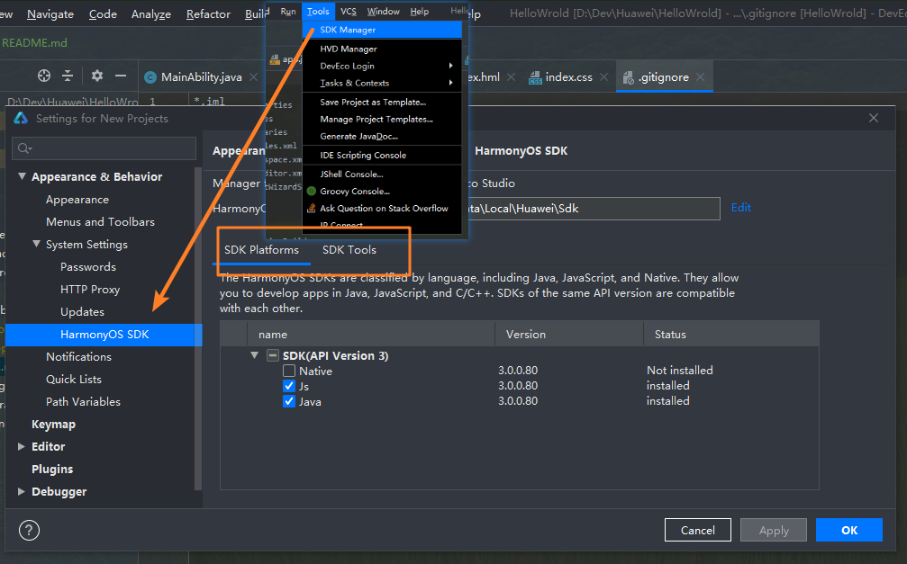

# 华为DevEco前端js实现HelloWrold

[官方文档](https://hmxt.org/deveco-studio)

整体步骤和官方文档基本一致，不过还是遇到了不少坑。

## 安装DevEco

官网下载解压包，按提示运行。不需要按文档上面配置代理。

## js开发

本地需要node环境。除了软件初次运行提示安装的SDK, 还需要在Tools/../SDK Platforms安装 `Js`和Tools/../SDK Tools安装`Previewer`

## 创建项目

直接选第一个空模板就好

## 安装模拟器

点一下refresh, 下载好模拟器。然后点运行

## 安装gradle和其他相关

模拟器运行后，主界面运行按钮还是灰色的。需要等gradle自动下载完，才能运行代码。

## 问题

### Tools/../SDK Platforms安装 `Js`下载慢

之前电脑用的yarn源，npm装包一直下不来。切回npm源，有点慢，但是Js安装成功。

也可以是用华为源，比较快。

> npm config set  registry https://mirrors.huaweicloud.com/repository/npm/

### gradle下载不了

电脑连接宽度，wifi都下不了，最多下到5M多就一直不动。尝试Tools中配置代理还是没用。最后，换成手机热点，挺快。下载时，需要打开电脑防火墙。

## gradle下载成功启动失败

gradle下载成功后，点击运行会自动配置模拟器。还需要联网下一些其他依赖才能成功跑起来，下载报错。

开始以为是本地host配过代理，修改无效。最后发现gradle.properties文件多了一些东西，可能是之前配置代理生成的，注释掉。依赖下载成功，项目启动。

